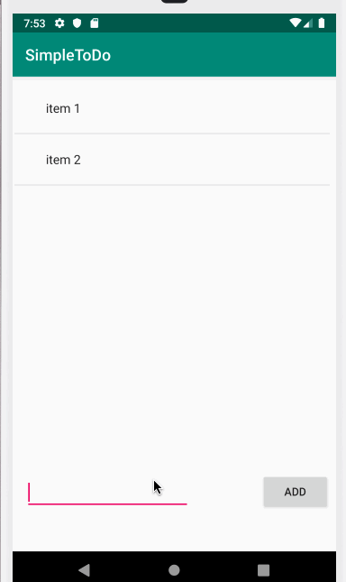

# SimpleToDo
**SimpleToDo** is an android app that allows building a todo list and basic todo items management functionality including adding new items, editing and deleting an existing item.

Submitted by: **Jesus Arredondo**

Time spent: ** 4 ** hours spent in total

Simple to do app
The following **required** functionality is completed:
* [ x ] User can **view a list of todo items**
* [ x ] User can **successfully add and remove items** from the todo list

Video Walkthrough

This is test repo and we want to add an image here

![] (https://github.com/Jussepen/SimpleToDo/raw/master/Screenshot_1561516702.png)

This is a video of the app 

